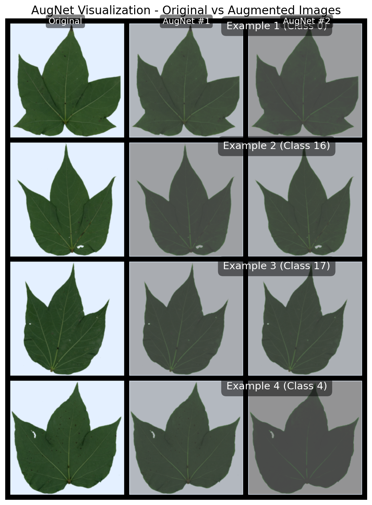

# Augnet - experimental record

| Augnet architecture | Highest accuracy| w/o Augmentation | Augnet Loss | Notes |
|---------------------|------------------|------------------|-------------|-------|
| Kornia Normalization | 0.4961           | 0.4625           |   0    | baseline model: tiny_vit_21m_224 |
| Kornia Norm + Rand Sharp | 0.4102           | 0.4625           |  0.7762     | baseline model: tiny_vit_21m_224 |
| Kornia Norm + Rand Const | 0.3750           | 0.4625           |  0.0373     | baseline model: tiny_vit_21m_224 |

## image

### Kornia Normalization

### Kornia Norm + Rand Sharp

### Kornia Norm + Rand Const

## Conclusion

我搞砸了，Kornia的Rand部分的參數不可學，如果直接改成可學習的參數，會導致參數更沒辦法學習，因為我的loss會約束圖片長一樣，但是取消了rand後，就更不可能會有不一樣的點了，所以loss歸0，參數跟預設值一樣。

## Extra Experiment

### Kornia Norm + img infonce + cls loss

0.4297

### Kornia Norm + grad infonce + cls loss

0.4531

### Kornia Rand Sharp + img infonce + cls loss

0.3301

### Kornia Rand Sharp + grad infonce + cls loss

0.3438

## Next Steps

- Revisit the augmentation strategy to ensure it enhances model performance.(randomness and consistency)
- Propose a new representation to final infonce loss.